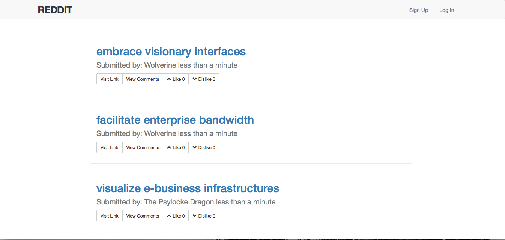
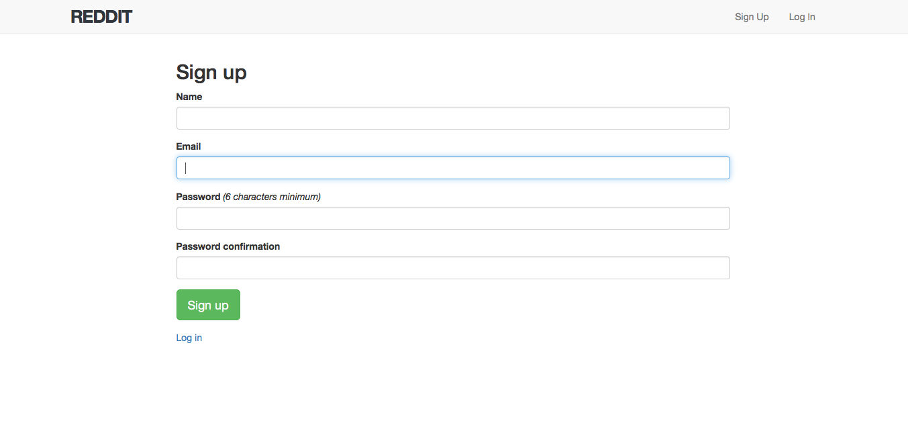
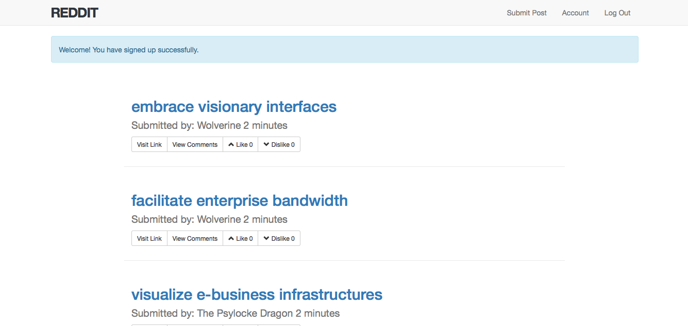

Joya-Reddit
==
Build Reddit (bookmarks and voting in Rails using Forms and relationships)

Features:

* Ruby Version 2.3.0

* Be able to utilize Forms in Rails

* Be able to add custom routes to your resources

* Modeling Data

* Publishing on Heroku

* Functioning db/seed.rb

* Authentication

* Devise(https://github.com/plataformatec/devise)

* Bootstrap(http://getbootstrap.com/)

* Simple Form(https://github.com/plataformatec/simple_form)

* Faker(https://github.com/stympy/faker)

* Acts_As_Votable(https://github.com/ryanto/acts_as_votable)

Database Creation & Initialization
==
* rake db:create
* rake db:migrate
* rake db:seed

Home Page
==

Sign Up
==

Logged In User Home
==

